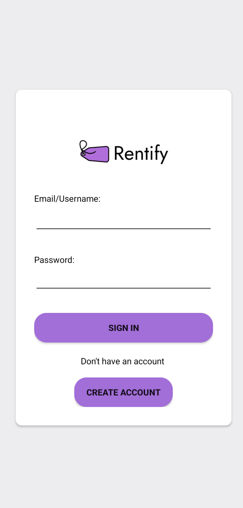
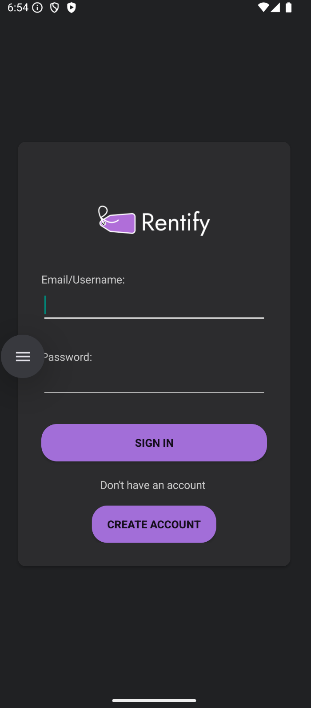

Project accomplished with fellow classmates

#### What’s Rentify?

Rentify is a mobile app designed to simplify the rental process by connecting lessors (users renting out items) and renters (users renting items). Its key features include:

 • Admin capabilities: Managing categories, accounts, and moderating content.
 
 • Lessors: Listing items for rent with details like price, availability, and rental terms.
 
 • Renters: Browsing and searching items, and submitting rental requests.
 
 • UI: Easy on the eyes with light and dark mode to browse all day!!

 

The app combines practical functionality with a clean, beginner-friendly interface, supported by Firebase for authentication and database management.

####Tech Stack:

Java, Android Studio, Gradle, GitHub, Firebase RealtimeDatabase, Git

#### Pictures

## Application Flows
### Login

#### Normal Flow
User inputs a username or email already existing in the system and the associated password.
The system retrieves the account from the database and sets it to the system state.

#### Validation
1. The system validates whether the two fields are not empty.
1. The system validates whether the login credentials are authentic.
For both the case where the email or username does not exist or the case where the password is incorrect,
the system will display an "incorrect username or password" message.

### Register

#### Normal Flow
User inputs a username, email, and password and selects a role.
The user can optionally input a first name and last name.
The system creates an account, saves it to the database, and sets it to the system state.

#### Validation
1. The system validates whether the required fields (username, email, password) are not empty.
1. The system validates whether the username and email are unique.
1. The system validates whether the email matches a regex for an email.
1. The system validates whether the passwords match and are of an acceptable complexity level.

### Welcome

#### Normal Flow
The system displays the user's first name if it exists, or username if it doesn't, and role.
The system displays an option to list all existing accounts if the user is an admin.
